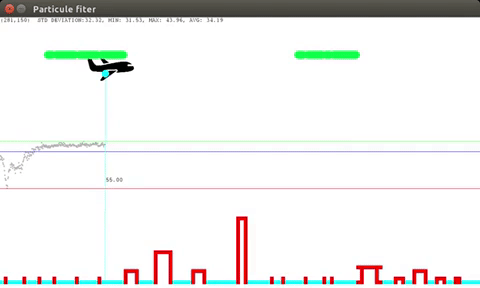

# Plane simulator for particle filter explanation

## Description
Base of program allowing to create particles to localise the plane


## Requirement
### Create Virtual Env (python3)
- Create a virtual env at the repository root
```
python -m venv venv
```

- Swtich to virtual env

```
source ./venv/bin/activate      
```
- To go back to host env simply execute command below:
```
deactivate
```

### Install requirments
- When venv is created and activate, install python dependencies:

```
pip install -r requirements.txt
```

## How to start
- Start the simulation
```
chmod +x ./scripts/Plane_Simulation.py
cd scripts
./Plane_Simulation.py
```

## Simulator command
* **Space bar**: pause resume the simulator
* **Left click**: Add an obstacle to the environment
* **Right click**: Remove an obstacle to the environment
* **S key**: Save the current environment (obstacles) into '\tmp\obstacles.npy'
* **R key**: Reset Plane position and particles filter
* **+ key**: Speed up the plane
* **- key**: Slow down the plane


## Program Behavior


## The job to do

### First Particule Filter

Update the file Particle_Filter.py to:

1. Create first particles set
```python
def getRandParticle(self,nbr, start_x, max_x, start_y, max_y):
        particle_list = []
        ###################################
        ##### TODO
        ##   nbr: number fo particles
        ##   start_x: min x possible coordinate
        ##   max_x: max x possible coordinate
        ##   start_y: min y possible coordinate
        ##   max_y: max y possible coordinate
        #####
        ## Use the Particle object to fill the list particle_list
        ##

        return particle_list
```

2. Weight the particles
```python
def weightingParticle(self,p_x, p_y, observed_distance):
        ###################################
        ##### TODO
        ##   p_x: x coordinate of the particle p
        ##  p_y: y coordinate of the particle p
        ##  observed_distance: distance to the ground
        ##  measure by the probe
        ##
        ## return weight corresponding to the given particle
        ## according observation
        ##
        ## Note ue the function distance_to_obstacle to get the
        ## estimate particle to the ground distance
        return ""
```

3. Select particles according the weights
```python
def weighted_random_choice(self,choices):
        ###################################
        ##### TODO
        ##   choices: dictionary holding particle coordination as key
        ##  and weight as value
        ##  return the selected particle key
        #####
        return ""
```

4. Resample particles
```python
def motion_prediction(self):
        new_particle_list = []
        choices = {}
        for i in range(len(self.particle_list)):
            choices[self.particle_list[i].id()] = self.particle_list[i].w

            ###################################
            ##### TODO
            ##   self.particle_list: list of available particles
            ##
            #####
            ## Use the function self.weighted_random_choice(choices) returning
            #  coordinate from a particle according a
            ##  roulette wheel algorithm
            #  Note that weighted_random_choice return a string containing coodinate x and y of the selected particle
            #   coord = self.weighted_random_choice(choices)
            #   x_coord = int(coord.split('_')[0])
            #   y_coord = int(coord.split('_')[1])

        return new_particle_list
```

### Influence of environement and different parameters

- Generate several test environments (at least 5) and highlight particle filter behaviour of each of them (specify the chosen, weight computation method, motion and observation error model)

- Test different weight computation method (at least 2) on these generated environments (specify the chosen motion and observation error model)

- Test different motion models (at least 2) error on these generated environments (specify the chosen weight computation method and observation error model)

- Test the influence of the observation error model on these generated environments (specify the chosen weight computation method and motion error model)

For each analysis, provide a set of screenshots and your associated comments and conclusion

## Example of result (video)

[](https://www.youtube.com/watch?v=3IBemFtwZ8g)


## Advanced Mode
### Context
- Improve your particle filter by adding moves capacity to the plane.
- By clicking on the up arrow and down arrow, the plane goes up or go done
- Generated particles no more stay on the same y coordinate and need to be generated and move on both x and y coordinates
### the job to do
- Modify the plane simulator in order to allow plane move on both x and y axes
- Modify particle filter to word on theses new conditions

[](
https://www.youtube.com/watch?v=Dvlx0mOFWq0)


